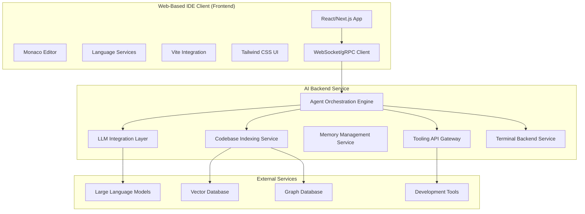

## Development Implementation Steps

### Phase 1: Frontend Foundation Setup (Months 1-2)
1. **Project Initialization**:
   - Initialize Next.js 14+ project with TypeScript and Vite integration
   - Configure Tailwind CSS with custom design system
   - Set up ESLint, Prettier, and development tooling
   
2. **Core Editor Integration**:
   - Integrate Monaco Editor with TypeScript language services
   - Implement syntax highlighting for web technologies
   - Set up basic autocomplete and IntelliSense
   - Configure custom themes and keybinding support

3. **Terminal Integration**:
   - Integrate xterm.js for web-based terminal emulation
   - Implement WebSocket communication for command execution
   - Set up terminal theming and customization options
   - Add support for multiple terminal instances

4. **File Explorer Development**:
   - Create React-based file tree component with Tailwind styling
   - Implement drag-and-drop file operations
   - Add file search and filtering capabilities
   - Integrate with browser File System Access API

### Phase 2: Backend Services Development (Months 2-4)
1. **Node.js Backend Setup**:
   - Initialize Express.js/Fastify server with TypeScript
   - Implement file storage service with cloud integration
   - Set up build service with Docker containerization
   - Configure WebSocket support for real-time features

2. **AI Service Integration**:
   - Implement AI service API with multi-provider support
   - Set up OpenAI, Claude, and Gemini API integrations
   - Configure response caching and rate limiting
   - Implement privacy controls and local processing options

3. **Database and Indexing**:
   - Set up IndexedDB for local caching and offline support
   - Implement vector database integration for semantic search
   - Configure Neo4j for code relationship mapping
   - Set up incremental indexing and real-time updates

### Phase 3: AI Integration Implementation (Months 4-7)
1. **Core AI Features**:
   - Implement AI-powered code completion with streaming
   - Develop natural language code generation capabilities
   - Set up code explanation and documentation features
   - Integrate AI-powered debugging and error analysis

2. **Advanced AI Capabilities**:
   - Develop AI agent mode for complex task completion
   - Implement image-to-code generation features
   - Set up custom AI rules and prompt management
   - Configure memory system with context awareness

3. **UI Integration**:
   - Develop AI chat interface with streaming responses
   - Implement inline suggestions and ghost text
   - Set up Magic Wand feature (Ctrl+K) for AI actions
   - Add AI status indicators and control panels

### Phase 4: Advanced Features and Testing (Months 7-10)
1. **Collaboration Features**:
   - Implement real-time collaborative editing
   - Set up WebSocket-based synchronization
   - Add user presence and cursor tracking
   - Integrate conflict resolution mechanisms

2. **Plugin System**:
   - Develop plugin architecture with sandboxed execution
   - Create plugin marketplace infrastructure
   - Implement VS Code-compatible extension system
   - Set up community contribution workflows

3. **Testing and Quality Assurance**:
   - Comprehensive unit and integration testing
   - AI-specific testing for accuracy and relevance
   - Performance testing and optimization
   - Security testing and vulnerability assessment

### Phase 5: Optimization and Deployment (Months 10-12)
1. **Performance Optimization**:
   - Implement Web Workers for heavy computations
   - Optimize bundle size and loading performance
   - Set up CDN for global asset delivery
   - Configure caching strategies and service workers

2. **Security Implementation**:
   - Implement end-to-end encryption for sensitive data
   - Set up SOC 2 compliance for enterprise customers
   - Configure audit logging and monitoring
   - Implement privacy controls and data retention policies

3. **Production Deployment**:
   - Deploy to scalable cloud infrastructure (AWS/GCP)
   - Set up Kubernetes orchestration for auto-scaling
   - Configure monitoring and alerting systems
   - Implement CI/CD pipelines for continuous deployment

### Recommended Libraries and Tools

#### Frontend Technologies
- **Framework**: Next.js 14+ with App Router for modern React development
- **Language**: TypeScript 5+ for comprehensive type safety
- **Styling**: Tailwind CSS 3+ with headlessUI for accessible components
- **Editor**: Monaco Editor with custom language services and themes
- **Terminal**: xterm.js with addon-fit, addon-web-links, and addon-search
- **State Management**: Zustand for lightweight, performant state handling
- **UI Components**: shadcn/ui for consistent, accessible component library
- **Animation**: Framer Motion for smooth transitions and micro-interactions
- **File Handling**: File System Access API with IndexedDB fallback
- **Communication**: Socket.io for WebSocket communication with fallbacks

#### Backend Technologies
- **Runtime**: Node.js 20+ with Express.js or Fastify for high performance
- **Language**: TypeScript with strict configuration for type safety
- **Database**: 
  - PostgreSQL for structured data and user management
  - Redis for caching and session storage
  - Neo4j for code relationship graphs
  - Pinecone/Weaviate for vector embeddings and semantic search
- **AI Integration**:
  - OpenAI SDK for GPT-4 and ChatGPT integration
  - Anthropic SDK for Claude integration
  - Google AI SDK for Gemini integration
  - Hugging Face Transformers for open-source models
  - Ollama for local LLM deployment
- **Code Analysis**:
  - Tree-sitter for multi-language AST parsing
  - TypeScript Compiler API for JavaScript/TypeScript analysis
  - ESLint API for linting and code quality analysis
- **Containerization**: Docker with multi-stage builds and Kubernetes for orchestration
- **Monitoring**: Prometheus for metrics, Grafana for visualization, Sentry for error tracking

#### Development and Deployment Tools
- **Version Control**: Git with GitHub/GitLab integration
- **CI/CD**: GitHub Actions or GitLab CI with automated testing and deployment
- **Cloud Platform**: AWS, Google Cloud, or Azure with multi-region deployment
- **CDN**: CloudFlare or AWS CloudFront for global asset delivery
- **Security**: OAuth2 with JWT tokens, bcrypt for password hashing
- **Testing**: Jest for unit testing, Playwright for end-to-end testing, Storybook for component testing

## Technical Implementation Details

### AI Service Integration Architecture
```typescript
interface AIService {
  // Core AI capabilities
  codeCompletion(context: CodeContext): Promise<CompletionResult>;
  explainCode(code: string, context: ProjectContext): Promise<ExplanationResult>;
  generateCode(prompt: string, language: string, context: ProjectContext): Promise<GenerationResult>;
  reviewCode(code: string, context: ProjectContext): Promise<ReviewResult>;
  
  // Agent capabilities
  executeTask(task: TaskDescription, context: ProjectContext): Promise<TaskResult>;
  decomposeTask(task: string): Promise<SubTask[]>;
  generateCommitMessage(changes: GitChanges): Promise<string>;
  
  // Image processing
  analyzeImage(image: ImageData, context: DesignContext): Promise<ImageAnalysisResult>;
  generateCodeFromImage(image: ImageData, framework: Framework): Promise<CodeGenerationResult>;
  
  // Memory and learning
  updateMemory(interaction: AIInteraction): Promise<void>;
  retrieveMemory(query: string, context: ProjectContext): Promise<MemoryResult[]>;
  
  // Customization
  updateRules(rules: AIRule[]): Promise<void>;
  customizePrompts(prompts: CustomPrompt[]): Promise<void>;
  setModelProvider(provider: ModelProvider): Promise<void>;
}

interface CodeContext {
  currentFile: FileInfo;
  cursorPosition: Position;
  selectedText?: string;
  recentChanges: Change[];
  projectStructure: ProjectStructure;
  gitStatus: GitStatus;
}

interface ProjectContext {
  projectId: string;
  files: FileMap;
  dependencies: Dependency[];
  framework: Framework;
  buildConfig: BuildConfiguration;
  customRules: AIRule[];
  teamPreferences: TeamSettings;
}
```

### Plugin System Architecture
```typescript
interface ShinPlugin {
  // Plugin metadata
  manifest: PluginManifest;
  
  // Lifecycle methods
  activate(context: ExtensionContext): Promise<void>;
  deactivate(): Promise<void>;
  update(newVersion: string): Promise<void>;
  
  // Contribution points
  contributes: {
    commands?: CommandContribution[];
    languages?: LanguageContribution[];
    themes?: ThemeContribution[];
    aiRules?: AIRuleContribution[];
    templates?: TemplateContribution[];
    menus?: MenuContribution[];
    keybindings?: KeybindingContribution[];
  };
  
  // AI integration capabilities
  aiCapabilities?: {
    codeCompletion?: CodeCompletionProvider;
    codeGeneration?: CodeGenerationProvider;
    customPrompts?: CustomPromptProvider;
    imageProcessing?: ImageProcessingProvider;
  };
  
  // Resource management
  resources: {
    maxMemoryUsage: number;
    maxCpuUsage: number;
    requiredPermissions: Permission[];
    externalDependencies: Dependency[];
  };
}

interface PluginManifest {
  name: string;
  version: string;
  description: string;
  author: string;
  license: string;
  repository: string;
  keywords: string[];
  engines: {
    shinIde: string;
    node?: string;
  };
  dependencies?: Record<string, string>;
  peerDependencies?: Record<string, string>;
}
```

### File System Abstraction
```typescript
interface FileSystemProvider {
  // Basic file operations
  readFile(path: string): Promise<Uint8Array>;
  writeFile(path: string, content: Uint8Array): Promise<void>;
  deleteFile(path: string): Promise<void>;
  renameFile(oldPath: string, newPath: string): Promise<void>;
  
  // Directory operations
  listDirectory(path: string): Promise<FileEntry[]>;
  createDirectory(path: string): Promise<void>;
  deleteDirectory(path: string, recursive?: boolean): Promise<void>;
  
  // File system events
  watchFile(path: string, callback: WatchCallback): Disposable;
  watchDirectory(path: string, callback: WatchCallback): Disposable;
  onFileChanged: Event<FileChangeEvent>;
  onFileCreated: Event<FileCreateEvent>;
  onFileDeleted: Event<FileDeleteEvent>;
  
  // Advanced features
  search(pattern: string, options: SearchOptions): Promise<SearchResult[]>;
  getFileStats(path: string): Promise<FileStat>;
  copyFile(sourcePath: string, destPath: string): Promise<void>;
  
  // Git integration
  getGitStatus(path: string): Promise<GitFileStatus>;
  getDiff(path: string): Promise<DiffResult>;
  
  // Cloud synchronization
  syncToCloud(): Promise<SyncResult>;
  syncFromCloud(): Promise<SyncResult>;
  getCloudStatus(): Promise<CloudSyncStatus>;
}

interface FileEntry {
  name: string;
  path: string;
  type: 'file' | 'directory';
  size: number;
  lastModified: Date;
  gitStatus?: GitFileStatus;
  isReadonly: boolean;
  mimeType?: string;
}
```

### Memory Management System
```typescript
interface MemoryManager {
  // Short-term memory (current session)
  shortTerm: {
    addInteraction(interaction: AIInteraction): void;
    getRecentInteractions(limit: number): AIInteraction[];
    getCurrentContext(): SessionContext;
    clearSession(): void;
  };
  
  // Long-term memory (persistent across sessions)
  longTerm: {
    storePattern(pattern: CodePattern): Promise<void>;
    retrievePatterns(query: string): Promise<CodePattern[]>;
    updateUserPreferences(preferences: UserPreferences): Promise<void>;
    getProjectMemory(projectId: string): Promise<ProjectMemory>;
  };
  
  // Semantic memory (code understanding)
  semantic: {
    indexCodebase(files: FileMap): Promise<void>;
    searchSemantic(query: string): Promise<SemanticResult[]>;
    updateIndex(changes: FileChange[]): Promise<void>;
    getRelatedCode(context: CodeContext): Promise<RelatedCode[]>;
  };
  
  // Memory optimization
  optimization: {
    compactMemory(): Promise<void>;
    getMemoryUsage(): MemoryStats;
    clearOldMemories(olderThan: Date): Promise<void>;
    exportMemory(): Promise<MemoryExport>;
    importMemory(data: MemoryExport): Promise<void>;
  };
}
```

## Success Metrics and KPIs (Updated)

### Performance Metrics
- **Initial Load Time**: < 1.5s for first-time users, < 0.5s for returning users
- **Keystroke Response**: < 30ms for code completion, < 80ms for AI suggestions
- **AI Response Time**: < 1.5s for code generation, < 3s for complex agent tasks
- **Memory Usage**: < 150MB browser memory for typical projects, < 300MB for large projects
- **Uptime**: 99.95% availability with automatic failover and disaster recovery
- **Network Efficiency**: < 100KB/minute data usage during active development

### AI Effectiveness Metrics
- **Code Completion Acceptance**: > 92% acceptance rate for AI suggestions
- **Agent Task Success**: > 88% successful completion of complex multi-step tasks
- **Code Quality Improvement**: 40%+ reduction in bugs and code smells
- **Developer Productivity**: 35%+ improvement in coding speed and accuracy
- **User Satisfaction**: > 4.7/5 rating for AI assistance quality
- **Context Relevance**: > 90% relevance score for AI-generated suggestions

### Adoption and Growth Metrics
- **User Adoption**: 100,000+ active users within first year
- **Feature Usage**: > 85% of users actively using AI features within first week
- **Retention Rate**: > 75% monthly active user retention
- **Enterprise Adoption**: 250+ enterprise customers within 18 months
- **Community Growth**: 2,500+ community-contributed extensions and templates
- **Geographic Reach**: Available in 15+ languages with localized AI models

### Technical Excellence Metrics
- **Code Coverage**: > 95% test coverage for core functionality
- **Security Score**: Zero critical vulnerabilities, < 5 medium-risk findings
- **Accessibility**: WCAG 2.1 AAA compliance with screen reader compatibility
- **Performance Score**: > 98 Lighthouse score across all metrics
- **API Reliability**: < 0.05% API error rate with < 100ms average response time
- **Plugin Ecosystem**: 500+ verified plugins with automated security scanning

This comprehensive specification provides a complete roadmap for building SHIN IDE as a revolutionary web-based development environment that matches and exceeds the capabilities of current industry leaders like Cursor and Windsurf IDE, with additional innovations in web-native architecture, advanced AI integration, and extensive customization options.# SHIN IDE - Advanced Web-Based IDE Development Specification

## Primary Goal and Vision

**Primary Goal**: Create a feature-rich web-based IDE that enhances developer productivity through AI integration, with special emphasis on modern web development technologies including Next.js, React, TypeScript, and Tailwind CSS.

### Vision Statement
SHIN IDE aims to revolutionize the development experience by seamlessly integrating advanced AI capabilities with traditional IDE features, creating a platform that not only assists with coding tasks but also understands project context, anticipates developer needs, and provides intelligent suggestions across the entire development lifecycle.

### Target Users
- **Web developers** working with modern JavaScript/TypeScript frameworks
- **Full-stack developers** building applications with React, Next.js ecosystems
- **Development teams** seeking AI-enhanced collaboration and development workflows
- **Individual developers** looking for productivity enhancements
- **Educational institutions** teaching modern web development
- **Enterprise organizations** requiring secure, scalable development environments

## Core Vision and Goals
- **AI-First Development**: Position AI as a central, indispensable component of the IDE, not merely an add-on
- **Enhanced Productivity**: Significantly boost developer productivity through intelligent code generation, prediction, and automation
- **Seamless Integration**: Ensure AI features are deeply integrated into the IDE workflow, feeling intuitive and natural
- **Modern Web Development Focus**: Provide specialized, first-class support for Next.js, React, TypeScript, and Tailwind CSS workflows
- **Extensibility**: Design a modular and extensible architecture that allows for future enhancements, custom integrations, and community contributions
- **Web-Based Accessibility**: Offer a fully functional IDE accessible directly through a web browser, enabling development from any device, anywhere
- **Performance Optimization**: Utilize advanced techniques like Web Workers for heavy computations while maintaining UI responsiveness
- **Security & Privacy**: Provide secure handling of user code with options for local AI processing to address privacy concerns
- **Universal Compatibility**: Ensure compatibility with any text editor or development tool through standardized formats
- **Progressive Enhancement**: System should degrade gracefully when offline or when AI services are unavailable

## Core IDE Features

SHIN IDE incorporates fundamental IDE capabilities enhanced with modern approaches and AI integration:

### 1. Code Editor Core
- **Multi-language Support**: Syntax highlighting for JavaScript, TypeScript, JSX/TSX, HTML, CSS, JSON, Markdown with emphasis on modern web technologies
- **Real-time Analysis**: Live error checking and linting integration (ESLint, TypeScript compiler)
- **Advanced Editing**: Multi-cursor editing, selection capabilities, smart text manipulation
- **Code Organization**: Code folding, minimap navigation, bracket matching, and smart indentation
- **Formatting Integration**: Prettier integration with automatic formatting and style enforcement
- **Layout Flexibility**: Split-view editing with horizontal and vertical splitting options
- **Customization**: Fully customizable keyboard shortcuts, keymaps, and editor preferences

### 2. Integrated Terminal
- **Full-featured Emulation**: Complete terminal access within the IDE using xterm.js
- **Multi-instance Support**: Multiple terminal tabs with session management
- **Environment Management**: Environment variable configuration and persistence
- **Command Enhancement**: Command history, autocomplete, and intelligent suggestions
- **Project Integration**: Integration with project-specific scripts and package.json commands
- **Flexible Layout**: Split terminal views for parallel command execution
- **AI Integration**: AI-powered command generation and execution assistance

### 3. Project Management
- **File Explorer**: Hierarchical file explorer with customizable views and drag-drop support
- **Advanced Search**: Project-wide search with regular expression and fuzzy matching support
- **Find & Replace**: Advanced find and replace functionality with regex and scope options
- **Workspace Support**: Multiple workspace support for complex multi-project scenarios
- **Navigation**: Quick file navigation, jumplist functionality, and recent files access
- **Project History**: Recent projects history with quick access and project templates

### 4. Version Control Integration
- **Native Git Support**: Complete Git integration with visual diff tools and merge capabilities
- **Repository Operations**: Commit, push, pull, branch operations directly from the IDE
- **Conflict Resolution**: Advanced merge conflict resolution tools with AI assistance
- **History Visualization**: Git history visualization, navigation, and blame/annotation features
- **Platform Integration**: GitHub/GitLab/Bitbucket integration for PR/MR workflows
- **AI-Enhanced**: AI-generated commit messages and code review assistance

### 5. Debugging Tools
- **Integrated Debugger**: Full debugging support for JavaScript/TypeScript applications
- **Breakpoint Management**: Conditional breakpoints, variable inspection, and watch expressions
- **Runtime Analysis**: Call stack navigation, evaluation console, and memory inspection
- **Hot Reloading**: Live reloading for React/Next.js applications with state preservation
- **Network Monitoring**: Request monitoring and inspection with performance analysis
- **AI Debugging**: AI-powered error analysis and fix suggestions

### 6. Build & Deployment Integration
- **Framework Support**: Integrated build systems for Next.js, Vite, React, and modern frameworks
- **Task Management**: Configurable task runner with custom commands and scripts
- **Live Preview**: Development server with live preview and hot module replacement
- **Deployment Pipelines**: Integration with hosting platforms (Vercel, Netlify, AWS)
- **Error Analysis**: Build error analysis with AI-powered troubleshooting assistance
- **Environment Config**: Multi-environment configuration management (dev/staging/prod)

### 7. Extension System
- **Plugin Architecture**: Robust plugin system for extending IDE functionality
- **Extension Marketplace**: Discovery and installation of community extensions
- **Theming System**: Comprehensive theme customization and editor appearance settings
- **Language Server Protocol**: Full LSP support for additional language integrations
- **API Framework**: Extensive APIs for integrating additional tools and services
- **Settings Sync**: User settings synchronization across devices and platforms

### 8. Collaboration Features
- **Real-time Editing**: Collaborative editing with presence indicators and conflict resolution
- **Shared Sessions**: Shared terminal sessions for pair programming and debugging
- **Code Review**: Commenting and annotation tools for collaborative code reviews
- **Team Communication**: Integrated chat and communication channels
- **Access Control**: Permission and role management for team projects
- **Activity Tracking**: Activity history and contribution tracking for team insights

## Modern Web Technology Support

SHIN IDE provides first-class, specialized support for modern web development technologies:

### 3.1 Primary Technology Stack

| Technology | Required Features | AI-Enhanced Capabilities |
|-----------|------------------|-------------------------|
| **Next.js** | App Router and Pages Router awareness<br>Server/Client Component distinction<br>Route file structure intelligence<br>API route development support<br>Next.js configuration assistance<br>Middleware and layout management | AI-powered component generation<br>Route optimization suggestions<br>Performance analysis and fixes<br>SEO optimization assistance<br>Server action generation<br>Deployment configuration |
| **React** | JSX/TSX syntax highlighting and formatting<br>Component tree visualization<br>Hook usage analysis and suggestions<br>React DevTools integration<br>Component state inspection<br>Performance optimization tools | Component scaffolding from descriptions<br>Hook pattern suggestions<br>State management recommendations<br>Performance bottleneck identification<br>Accessibility compliance checking<br>Testing code generation |
| **TypeScript** | Advanced type checking and inference<br>Type definition navigation and generation<br>Intelligent refactoring with type awareness<br>tsconfig.json management and validation<br>Type error explanations and fixes<br>TypeScript version selection | Type inference enhancement<br>Generic type generation<br>Interface creation from usage<br>Migration from JavaScript assistance<br>Type safety analysis<br>Advanced type pattern suggestions |
| **Tailwind CSS** | Class autocompletion and validation<br>Hover previews for applied styles<br>Class extraction and component suggestions<br>Tailwind config editing support<br>Responsive design preview tools<br>Dark mode toggling and previewing | Design-to-code generation<br>Style optimization suggestions<br>Component extraction from utility classes<br>Responsive design assistance<br>Accessibility color compliance<br>Custom design system creation |
| **Vite** | Fast development server integration<br>HMR (Hot Module Replacement) support<br>Vite plugin configuration assistance<br>Build optimization suggestions<br>Environment variable management<br>Asset handling and optimization | Configuration optimization<br>Plugin recommendation and setup<br>Bundle analysis and optimization<br>Performance monitoring<br>Custom build script generation<br>Deployment preparation |

### 3.2 Extended Technology Ecosystem

#### CSS & Styling
- **CSS Preprocessors**: SCSS/Sass, Less, PostCSS with intelligent compilation and optimization
- **CSS-in-JS**: Styled Components, Emotion, Stitches with type-safe styling assistance
- **Design Systems**: Chakra UI, Mantine, Ant Design with component intelligence

#### State Management
- **Modern Solutions**: Redux Toolkit, Zustand, Jotai, Recoil with pattern recognition
- **Server State**: TanStack Query, SWR, Apollo Client with caching optimization
- **Form Management**: React Hook Form, Formik with validation assistance

#### API & Data Layer
- **API Technologies**: REST, GraphQL (Apollo, URQL), tRPC with type-safe client generation
- **Database Integration**: Prisma, Drizzle, TypeORM with schema management
- **Real-time**: WebSocket, Socket.io, Server-Sent Events with connection management

#### Testing & Quality Assurance
- **Testing Frameworks**: Jest, Vitest, Testing Library with automated test generation
- **E2E Testing**: Cypress, Playwright with test scenario creation
- **Code Quality**: ESLint, Prettier, TypeScript with automated fixing

#### Backend & Infrastructure
- **Runtime**: Node.js, Deno, Bun with performance optimization
- **Frameworks**: Express, Fastify, NestJS, tRPC with API generation
- **Databases**: PostgreSQL, MongoDB, Firebase, Supabase with query optimization
- **Authentication**: NextAuth.js, Auth.js, Firebase Auth, OAuth with secure implementation

#### Deployment & DevOps
- **Containerization**: Docker integration with Dockerfile generation and optimization
- **Cloud Platforms**: Vercel, Netlify, AWS, GCP with deployment pipeline automation
- **CI/CD**: GitHub Actions, GitLab CI with workflow generation
- **Monitoring**: Analytics integration and performance monitoring setup

## Core Architecture Requirements

### 1. Frontend Technology Stack
- **Framework**: React 18+ with TypeScript
- **Build Tool**: Vite for fast development and optimized builds
- **Styling**: Tailwind CSS for responsive design
- **State Management**: Zustand or Redux Toolkit
- **UI Components**: Custom component library with shadcn/ui base
- **Code Editor**: Monaco Editor (VS Code's editor) with custom extensions
- **File System**: Browser File System Access API with fallback to virtual FS

### 2. Backend Infrastructure
- **Runtime**: Node.js with Express.js or Fastify
- **Database**: PostgreSQL for user data, Redis for caching
- **Authentication**: JWT with OAuth2 (GitHub, Google, Microsoft)
- **File Storage**: AWS S3 or Google Cloud Storage
- **Container Support**: Docker integration for project isolation
- **Real-time Communication**: WebSocket for collaborative features

### 3. AI Integration Architecture (Cursor/Windsurf-like Features)

#### AI Agent Core Features:
- **Code Completion**: Context-aware autocomplete with ML models
- **Code Generation**: Natural language to code conversion
- **Code Explanation**: AI-powered code documentation and explanation
- **Refactoring Assistant**: Intelligent code refactoring suggestions
- **Bug Detection**: Real-time error detection and fix suggestions
- **Code Review**: Automated code review with improvement suggestions
- **Chat Interface**: Integrated AI chat for development assistance

#### AI Models Integration:
- **Primary**: OpenAI GPT-4/Claude integration via API
- **Code-Specific**: GitHub Copilot-style completion using CodeT5/StarCoder
- **Local Models**: Option for local LLM integration (Ollama support)
- **Custom Training**: Fine-tuning capabilities for project-specific patterns

## AI Integration Features

Drawing inspiration from Cursor IDE and Windsurf IDE, SHIN IDE integrates advanced AI capabilities that enhance the development workflow:

### 4.1 Core AI Capabilities

#### AI Agent System ("Cascade")
Implement an AI agent system similar to Windsurf's Cascade that can:
- **Autonomous Understanding**: Comprehend project context, requirements, and architectural patterns
- **Task Decomposition**: Break down high-level instructions into actionable, sequential steps
- **Multi-step Execution**: Execute complex tasks like creating components, implementing features, or fixing bugs
- **Tool Integration**: Intelligently run terminal commands, manage dependencies, and execute builds
- **Reasoning Transparency**: Explain decision-making process and provide clear rationale
- **Adaptive Learning**: Learn from user feedback to improve future interactions and recommendations
- **Context Awareness**: Maintain awareness of project state, recent changes, and user preferences

#### Intelligent Code Generation
- **Natural Language to Code**: Convert natural language descriptions into functional components and features
- **Context-Aware Completion**: Multi-line code suggestions that understand project structure and patterns
- **Function Body Generation**: Complete functions from signatures, comments, or partial implementations
- **Automatic Test Generation**: Create comprehensive test suites based on implementation code
- **Documentation Generation**: Generate JSDoc comments, README files, and API documentation
- **Language Conversion**: Convert between JavaScript and TypeScript with proper type inference
- **Framework-Specific Generation**: Generate Next.js pages, React components, API routes with best practices

#### Code Analysis & Enhancement
- **Automated Code Review**: Comprehensive code review with best practice recommendations
- **Performance Optimization**: React and Next.js specific performance improvements and suggestions
- **Accessibility Compliance**: WCAG compliance checking with automated fixes and improvements
- **Security Analysis**: Vulnerability detection and remediation for web applications
- **Refactoring Intelligence**: Smart refactoring suggestions with impact analysis and preview
- **Type Enhancement**: TypeScript type inference and enhancement with generic optimization

#### Natural Language Interaction
- **Codebase Chat**: Interactive chat interface for asking questions about project structure and logic
- **Command Processing**: Natural language command palette with intelligent operation mapping
- **Contextual Help**: Dynamic help system that provides relevant documentation and examples
- **Code Explanation**: Plain language explanations of complex code blocks and architectural decisions
- **Error Interpretation**: Intelligent error analysis with actionable solution suggestions
- **Learning Assistant**: Interactive tutorials and concept explanations with practical examples

### 4.2 Advanced AI Features

#### Project Memory ("Memories")
Implement a comprehensive memory system similar to Windsurf's Memories:
- **Semantic Codebase Understanding**: Build and maintain deep understanding of entire project architecture
- **Interaction History**: Remember previous conversations, decisions, and solutions within project context
- **Architectural Memory**: Preserve design decisions, coding standards, and project-specific conventions
- **Pattern Recognition**: Adapt suggestions based on established project patterns and user preferences
- **Dependency Awareness**: Maintain understanding of library usage and integration patterns
- **Impact Analysis**: Provide project-wide impact assessment for proposed changes and refactoring

#### Architecture Assistant
- **Component Visualization**: Interactive visualization of component relationships and data flow
- **System Design**: Architecture pattern recommendations with detailed explanations and trade-offs
- **Consistency Enforcement**: Automated enforcement of coding standards and architectural decisions
- **Migration Planning**: Strategic planning for framework upgrades and technology migrations
- **Technical Debt**: Identification and prioritization of technical debt with remediation strategies
- **Scalability Analysis**: Performance and scalability recommendations for growing applications

#### Supercomplete
Implement advanced code completion system similar to Windsurf's Supercomplete:
- **Function Body Generation**: Complete entire function implementations from signatures or comments
- **Component Scaffolding**: Generate complete React components from descriptive comments or specifications
- **Pattern Completion**: Smart completion of repetitive code patterns and boilerplate
- **API Integration**: Generate client-side API integration code from documentation or schemas
- **State Management**: Generate Redux, Zustand, or other state management boilerplate
- **Form Generation**: Create form validation logic and UI components from specifications

#### Command Mode
- **Natural Language Commands**: Process complex IDE operations through natural language input
- **Refactoring Operations**: Execute complex refactoring through simple, descriptive commands
- **Search & Replace**: Project-wide search and replace with AI understanding of context and intent
- **Workflow Automation**: Automated workflow execution from high-level task descriptions
- **Context-Aware Suggestions**: Intelligent command suggestions based on current context and history
- **Custom Automation**: Create and save custom command sequences for repeated operations

### 4.3 Specialized AI Workflows ("Flows")

| Flow Name | Description | Capabilities |
|-----------|-------------|--------------|
| **Component Creator** | Generate React/Next.js components from natural language descriptions | TypeScript types, Tailwind styling, accessibility features, testing boilerplate |
| **API Builder** | Create full-stack API implementations | Endpoint creation, data models, client-side fetching, error handling, validation |
| **Test Engineer** | Generate comprehensive test suites | Unit tests, integration tests, E2E scenarios, mocking, coverage optimization |
| **Debugger Assistant** | Analyze and resolve errors and exceptions | Root cause analysis, fix suggestions, debugging strategies, error prevention |
| **Documentation Writer** | Generate comprehensive project documentation | Component docs, API documentation, README files, architectural decision records |
| **Accessibility Expert** | Review and fix accessibility issues | WCAG compliance, screen reader optimization, keyboard navigation, color contrast |
| **Performance Optimizer** | Identify and fix performance bottlenecks | Bundle analysis, render optimization, caching strategies, Core Web Vitals improvement |
| **Migration Assistant** | Help convert code between frameworks/versions | Framework upgrades, dependency updates, breaking change resolution, compatibility analysis |
| **Design System Architect** | Create and maintain design systems | Component libraries, theming systems, style guides, consistency enforcement |
| **Database Engineer** | Design and optimize database interactions | Schema design, query optimization, migration scripts, ORM configuration |

## Core IDE Features

### 1. Editor Features
- **Multi-language Support**: JavaScript, TypeScript, Python, Go, Rust, Java, C++, HTML, CSS, JSON, YAML, Markdown
- **Syntax Highlighting**: Advanced syntax highlighting with themes
- **IntelliSense**: Smart autocomplete with type information
- **Code Folding**: Collapsible code blocks
- **Multi-cursor Editing**: Simultaneous multi-line editing
- **Vim/Emacs Keybindings**: Optional key binding modes
- **Minimap**: Code overview panel
- **Bracket Matching**: Smart bracket and quote pairing
- **Search & Replace**: Advanced find/replace with regex support

### 2. File Management System
- **Project Explorer**: Tree view with drag-drop support
- **File Search**: Fuzzy file finder (Ctrl+P functionality)
- **Git Integration**: Visual git status, diff viewer, branch management
- **File Tabs**: Multiple file tabs with tab groups
- **File Upload/Download**: Drag-drop file upload and project export
- **Workspace Management**: Multiple workspace support
- **Remote File Systems**: SSH/SFTP integration for remote development

### 3. Terminal Integration
- **Embedded Terminal**: Full-featured terminal emulator (xterm.js) with AI integration
- **Multiple Terminals**: Support for multiple terminal instances
- **AI Command Assistance**: AI-powered command suggestions and explanations
- **Terminal Theming**: Customizable terminal appearance
- **Command History**: Persistent command history with AI-powered search
- **Process Management**: Background process monitoring
- **Seamless Integration**: AI agent can execute commands and analyze output

### 4. New Generation Programming Language Support

#### First-class support for modern web development technologies:
- **Vite**: Fast build tool integration for rapid development with intelligent configuration
- **TypeScript**: Full type-checking, autocompletion, and refactoring support with AI assistance
- **Next.js**: Optimized development experience for React applications, including server-side rendering and static site generation
- **React**: Comprehensive support for React component development, JSX, and hooks with AI-powered component generation
- **Tailwind CSS**: Intelligent autocompletion, linting, and integration for utility-first CSS development with AI design suggestions

#### Additional Language Support:
- JavaScript/TypeScript ecosystem with advanced AI assistance
- Python with data science and backend development support
- Go, Rust, Java, C++ with language-specific AI optimizations
- Syntax highlighting, linting, debugging, and intelligent code assistance for all supported technologies

### 5. Development Tools
- **Live Preview**: Real-time preview with hot reload
- **DevTools Integration**: Browser developer tools integration
- **Package Manager**: npm, yarn, pnpm support with GUI
- **Linting**: ESLint, Prettier integration with auto-fix
- **Testing**: Jest, Vitest, Cypress integration with test runner
- **Debugging**: Visual debugger with breakpoints
- **Performance Profiling**: Bundle analyzer and performance metrics

### 6. AI-Powered Development Features

#### Intelligent Code Assistant:
- Natural language code generation with contextual awareness
- Explain code functionality in plain English with deep understanding
- Generate comprehensive unit tests automatically
- AI-powered code documentation generation with architectural insights
- API integration assistance with security best practices
- Database query generation and optimization
- Regular expression creation and explanation with real-world examples

#### Smart Refactoring and Optimization:
- Extract functions/components automatically with intelligent naming
- Rename variables across files with semantic understanding
- Convert between different coding patterns and paradigms
- Optimize performance bottlenecks with specific recommendations
- Migrate to newer framework versions with compatibility checks
- Convert JavaScript to TypeScript with proper type inference
- Security vulnerability detection and automated remediation

#### Advanced AI Agent Capabilities:
- **Cascade-like Agent Mode**: End-to-end task completion from natural language instructions
- **Multi-step Task Decomposition**: Break down complex requirements into executable sub-tasks
- **Autonomous Execution**: Independent code writing, command execution, and file system operations
- **Tool Integration**: Seamless use of Git, npm, Docker, and other development tools
- **Progress Monitoring**: Real-time task progress with user intervention capabilities
- **Continuous Learning**: Adaptation from past executions and user feedback

#### Collaborative AI:
- Pair programming with AI that understands project context
- Code review automation with architectural insights
- Architecture suggestions based on best practices
- Performance optimization recommendations with measurable metrics
- Best practices enforcement with team-specific rules
- AI-powered conflict resolution during merge operations

## Additional Features and Capabilities

### Real-time Collaboration
- **Multi-user Editing**: 
  - Operational Transformation algorithms for conflict-free collaborative editing
  - Real-time cursor and selection tracking across users
  - User presence indicators with avatar and status
  - Voice/video chat integration for remote pair programming
- **Shared AI Context**: 
  - Collaborative AI memory and project understanding
  - Team-shared custom prompts and coding standards
  - Collaborative code review with AI assistance
- **Communication**: 
  - WebSocket-based real-time synchronization
  - In-editor comments and discussions
  - Integration with communication platforms (Slack, Discord, Teams)

### Extensibility and Plugin Ecosystem
- **Plugin Architecture**: 
  - VS Code-compatible extension system
  - Plugin marketplace with community contributions
  - Revenue sharing for premium plugins
  - Automated testing and security scanning for plugins
- **AI-Powered Extensions**: 
  - Plugins that leverage the AI agent for custom functionality
  - Framework-specific code generators (React, Vue, Angular)
  - Design-to-code plugins (Figma, Adobe XD integration)
  - Database integration plugins with AI query generation
- **Custom Tool Integration**: 
  - API integrations for project management tools (Jira, Trello)
  - CI/CD pipeline integration (GitHub Actions, Jenkins)
  - Cloud platform deployment (Vercel, Netlify, AWS)

### Advanced Customization Options
- **Themes and Appearance**: 
  - Monaco Editor's comprehensive theming system
  - Custom CSS injection for advanced styling
  - Accessibility themes with high contrast and font scaling
  - Animation preferences and motion reduction options
- **Keybindings**: 
  - VS Code, Vim, and Emacs keybinding compatibility
  - Custom keyboard shortcut configuration
  - Gesture support for touch devices
  - Voice command integration (future enhancement)
- **Workspace Configuration**: 
  - Project-specific settings and preferences
  - Team workspace templates and standards
  - Environment variable management
  - Docker integration for containerized development

### Industry Context and Competitive Analysis

#### Current Market Landscape
- **Windsurf IDE** (Launched Late 2024):
  - Free tier: 50 user prompt credits, 200 flow action credits
  - Features: Drag-and-drop images, terminal integration, JetBrains IDE compatibility
  - Plugin support for Figma, Slack, and other services
  - Multi-provider AI model support
- **Cursor IDE**:
  - Fast autocomplete with sensible keyboard shortcuts
  - Agent mode for complex task completion
  - Strong focus on code completion and inline editing
  - Privacy mode for sensitive code handling

#### SHIN IDE Competitive Advantages
- **Web-Native Architecture**: No installation required, universal accessibility
- **Advanced Image Processing**: Superior design-to-code capabilities
- **Comprehensive Plugin System**: Broader extensibility than existing solutions
- **Multi-Model AI Support**: Flexibility in AI provider selection
- **Enterprise-Ready**: Advanced security, collaboration, and deployment options
- **Open Source Potential**: Community-driven development and transparency

### Implementation Challenges and Solutions

#### Browser Performance Limitations
- **Challenge**: Running AI models locally in browser is resource-intensive
- **Solution**: 
  - Hybrid approach with cloud-based primary processing
  - Optional lightweight local models for basic functionality
  - Progressive Web App optimization for better performance
  - Efficient memory management and garbage collection

#### Privacy and Security Concerns
- **Challenge**: Users hesitant to send code to external AI services
- **Solution**: 
  - Local processing options with reduced capabilities
  - Selective privacy controls for different project types
  - Transparent data handling policies
  - Enterprise on-premises deployment options

#### Development Complexity
- **Challenge**: Building a comprehensive IDE requires extensive expertise
- **Solution**: 
  - Leverage existing libraries (Monaco Editor, xterm.js)
  - Modular architecture for incremental development
  - Community contributions through open development model
  - Strategic partnerships with AI providers and tool vendors

### Future Enhancement Roadmap

#### Short-term Enhancements (6-12 months)
- Voice input and natural language commands
- Advanced code review with architectural analysis
- Mobile-responsive design for tablet development
- Offline functionality with service worker implementation

#### Medium-term Enhancements (1-2 years)
- AI-powered project scaffolding and architecture suggestions
- Advanced debugging with AI-assisted root cause analysis
- Integration with popular design tools (Sketch, Framer)
- Multi-language support beyond web technologies

#### Long-term Vision (2+ years)
- Virtual reality/augmented reality development environment
- AI-powered mentorship and learning recommendations
- Advanced team analytics and productivity insights
- Integration with emerging development paradigms and technologies

## Architectural Design and Implementation Guidelines

SHIN IDE follows a modular, client-server architecture, emphasizing scalability, performance, and extensibility with AI-first design principles.

### Overall Architecture



## Frontend Components Architecture

### Core Components Specification

#### 1. Code Editor (Monaco Editor Integration)
- **Library**: Monaco Editor (VS Code's editor core) with custom language services
- **Features**: 
  - Syntax highlighting for JavaScript, TypeScript, JSX, TSX, HTML, CSS, JSON, Markdown
  - IntelliSense with type information and documentation
  - Multi-cursor editing and advanced text manipulation
  - Custom themes with dark/light mode support
  - Minimap and code folding capabilities
  - Real-time error highlighting and suggestions
- **AI Integration**: Inline code suggestions, ghost text completions, and AI-powered refactoring
- **Styling**: Tailwind CSS for consistent theming and responsive design

#### 2. Terminal Emulator (xterm.js Integration)
- **Library**: xterm.js for full-featured terminal emulation
- **Features**:
  - Multiple terminal instances with tab management
  - Full shell command support (bash, zsh, powershell)
  - Persistent command history and session recovery
  - Copy/paste functionality with keyboard shortcuts
  - Customizable themes and font options
- **AI Integration**: AI-powered command generation and execution confirmation
- **Performance**: Web Workers for command processing to maintain UI responsiveness

#### 3. File Explorer (Custom React Component)
- **Framework**: React with TypeScript for type safety
- **Features**:
  - Tree view with expandable/collapsible folders
  - Drag-and-drop file operations (move, copy, upload)
  - File search with fuzzy matching
  - Context menus for file operations
  - Git status indicators (modified, staged, untracked)
  - File type icons and syntax-aware previews
- **Styling**: Tailwind CSS with custom component library
- **State Management**: Zustand for efficient state handling

#### 4. AI Chat Interface (Sidebar Panel)
- **Design**: Resizable sidebar or modal panel built with React and Tailwind CSS
- **Features**:
  - Text input with markdown support
  - Image upload via drag-and-drop or file picker
  - Conversation history with search functionality
  - Code block rendering with syntax highlighting
  - Copy/paste integration with editor
  - Voice input support (future enhancement)
- **AI Integration**: Real-time streaming responses with loading indicators
- **Accessibility**: Full keyboard navigation and screen reader support

#### 5. Plugin Manager Interface
- **Architecture**: React-based management interface with plugin marketplace
- **Features**:
  - Plugin discovery and installation
  - Version management and updates
  - Configuration panels for installed plugins
  - Plugin dependency resolution
  - Performance monitoring and resource usage
- **Security**: Sandboxed plugin execution environment
- **API**: Standardized plugin API for IDE and AI integration

## Backend Services Architecture

### Core Services Specification

#### 1. File Storage Service
- **Storage Options**:
  - **Cloud-based**: AWS S3, Google Cloud Storage, or Azure Blob Storage for persistent storage
  - **Browser-based**: IndexedDB for local caching and offline functionality
  - **Hybrid Approach**: Local-first with cloud sync for collaboration
- **Features**:
  - Encrypted file storage with user-specific access controls
  - Version history and backup management
  - Real-time file synchronization across devices
  - Project template management and sharing
- **API**: RESTful API with WebSocket support for real-time updates
- **Security**: End-to-end encryption with user-controlled keys

#### 2. Build Service (Node.js-based)
- **Framework**: Node.js with Express.js or Fastify for high performance
- **Capabilities**:
  - Execute build commands for Vite, Next.js, React, and other frameworks
  - Package manager integration (npm, yarn, pnpm)
  - Custom build script execution with sandboxing
  - Build artifact management and deployment
  - Performance monitoring and optimization suggestions
- **Containerization**: Docker containers for isolated build environments
- **Scalability**: Kubernetes orchestration for auto-scaling based on demand

#### 3. AI Service API
- **Architecture**: Microservices-based with load balancing
- **Model Support**:
  - **Cloud Providers**: OpenAI GPT-4, Claude, Google Gemini, Anthropic
  - **Open Source**: Hugging Face Transformers, CodeT5, StarCoder
  - **Local Models**: Ollama integration for privacy-focused deployments
- **Features**:
  - Multi-model routing based on task requirements
  - Response caching and optimization
  - Rate limiting and usage analytics
  - Custom fine-tuning capabilities
- **Privacy**: Optional local processing with on-device inference
- **Performance**: Response streaming and parallel processing

#### 4. Plugin API Gateway
- **Design**: Standardized RESTful API with GraphQL support
- **Capabilities**:
  - Plugin registration and discovery
  - Secure plugin execution environment
  - Resource monitoring and throttling
  - Integration with external services (GitHub, Figma, Slack)
  - Custom tool development framework
- **Security**: OAuth2 integration with scoped permissions
- **Extensibility**: Plugin SDK with TypeScript definitions

## AI Agent Architecture

### Local Indexing and Memory System
- **Indexing Engine**:
  - **AST Parsing**: Tree-sitter for multi-language syntax analysis
  - **Symbol Extraction**: Function, class, and variable mapping
  - **Dependency Analysis**: Import/export relationship tracking
  - **Semantic Search**: Vector embeddings for contextual code search
- **Storage Backend**:
  - **Local**: IndexedDB for browser-based caching
  - **Cloud**: Vector databases (Pinecone, Weaviate, Qdrant)
  - **Graph**: Neo4j for relationship mapping
- **Memory Categories**:
  - **Short-term**: Current session context and recent interactions
  - **Long-term**: Project patterns, user preferences, and code conventions
  - **Semantic**: Code meaning and architectural patterns

### Context Management Engine
- **Context Gathering**:
  - Current file and cursor position analysis
  - Related file detection through imports and references
  - Git history and recent changes integration
  - User behavior patterns and preferences
- **Relevance Scoring**:
  - Machine learning-based context ranking
  - Recency weighting for temporal relevance
  - User feedback integration for continuous improvement
- **Privacy Controls**:
  - Selective context sharing with external AI services
  - Local-only processing options for sensitive code
  - Granular privacy settings per project

### Model Selection and Response Integration
- **Dynamic Model Selection**:
  - Task-specific model routing (completion vs. generation vs. analysis)
  - Performance and cost optimization
  - Fallback mechanisms for service availability
- **Response Processing**:
  - Monaco Editor API integration for seamless code application
  - User confirmation workflows for significant changes
  - Undo/redo integration with AI-generated modifications
- **Quality Assurance**:
  - Code validation and syntax checking
  - Best practices enforcement
  - Security vulnerability scanning

### Image Processing and Design Integration
- **Image Analysis**:
  - Computer vision for UI mockup interpretation
  - Design pattern recognition and extraction
  - Color scheme and layout analysis
- **Code Generation**:
  - HTML/CSS generation from visual designs
  - React component creation from mockups
  - Responsive design implementation
  - Tailwind CSS class generation
- **Integration Workflow**:
  - Drag-and-drop image upload interface
  - Real-time preview of generated code
  - Iterative refinement based on user feedback

## Implementation Considerations

### Performance and Latency
- **Asynchronous Operations**: Non-blocking AI operations with streaming responses
- **Aggressive Caching**: Multi-level caching for code completions and AI responses
- **Edge Computing**: Exploration of edge deployment for reduced latency
- **Local LLMs**: Option for local model deployment for sensitive environments
- **Incremental Processing**: Real-time incremental code analysis and indexing

### Security and Privacy
- **Data Encryption**: End-to-end encryption for all communications
- **Access Control**: Role-based permissions and authentication
- **Prompt Sanitization**: Input validation and prompt injection prevention
- **Local-First Approach**: Sensitive data processing on client side where possible
- **Audit Logging**: Comprehensive security event tracking
- **Sandboxed Execution**: Isolated execution environments for AI agents

### Extensibility and Customization
- **Robust Plugin Architecture**: Community-driven extension ecosystem
- **Extensive Configuration**: Granular customization of AI behavior
- **Custom AI Rules**: User-defined coding standards and preferences
- **Team Sharing**: Collaborative rule and prompt libraries
- **API-First Design**: Open APIs for third-party integrations

### User Experience (UX)
- **Seamless AI Integration**: Natural, non-intrusive AI assistance
- **Transparency**: Clear indication of AI reasoning and confidence levels
- **User Control**: Granular control over AI behavior and suggestions
- **Progressive Enhancement**: Graceful degradation when AI services are unavailable
- **Accessibility**: Full compliance with web accessibility standards

### Testing and Evaluation
- **Comprehensive Testing**: Unit, integration, and AI-specific testing suites
- **Performance Benchmarking**: Continuous performance monitoring and optimization
- **AI Model Evaluation**: Accuracy, relevance, and safety metrics
- **User Acceptance Testing**: Extensive UAT with real-world development scenarios
- **A/B Testing**: Data-driven feature optimization and rollout

## Technology Stack Recommendations

### Web-Based IDE Client
- **Framework**: React 18+ with Next.js 14+ for app structure and routing
- **UI Library**: Tailwind CSS with shadcn/ui components
- **Core Editor**: Monaco Editor with custom language services
- **Build Tool**: Vite 5+ for fast development and optimized builds
- **Language**: TypeScript 5+ for type safety
- **State Management**: Zustand for lightweight state management
- **Communication**: WebSocket with fallback to gRPC-web

### AI Backend Services
- **Languages/Frameworks**: 
  - Python with FastAPI for AI services
  - Node.js with Express/Fastify for real-time features
- **LLM Integration**: 
  - OpenAI GPT-4/Claude API for advanced reasoning
  - Google Gemini API for multimodal capabilities
  - Hugging Face Transformers for custom models
  - Llama.cpp/Ollama for local LLM deployment
- **Codebase Indexing**: 
  - Tree-sitter for AST parsing
  - Faiss/Pinecone for vector embeddings
  - Neo4j for relationship graphs
- **Memory Management**: 
  - Redis for caching and session storage
  - PostgreSQL for persistent data
  - Vector databases (Weaviate/Qdrant) for semantic search
- **Infrastructure**: 
  - Docker and Kubernetes for containerization
  - gRPC for service communication
  - WebSockets for real-time features
- **Monitoring**: 
  - Prometheus and Grafana for metrics
  - Sentry for error tracking
  - Custom telemetry for AI performance

### Development and Deployment
- **Version Control**: Git with automated CI/CD pipelines
- **Cloud Platform**: AWS/GCP/Azure with multi-region deployment
- **CDN**: CloudFront/CloudFlare for global asset delivery
- **Security**: OAuth2/JWT authentication with MFA support
- **Backup**: Automated backup strategies for user data and configurations

## Development Phases and Implementation Roadmap

### Phase 1: Foundation and Core IDE (Months 1-3)
- **Core Editor**: Monaco Editor integration with TypeScript support
- **Basic File Management**: Project explorer and file operations
- **Terminal Integration**: Embedded terminal with basic command support
- **Authentication**: User authentication and project management
- **Basic UI**: Responsive interface with Tailwind CSS
- **Vite Integration**: Fast build tool setup and configuration

### Phase 2: Language Support and Development Tools (Months 4-5)
- **Multi-language Support**: JavaScript, TypeScript, React, Python syntax highlighting
- **IntelliSense**: Advanced autocomplete and type checking
- **Linting and Formatting**: ESLint, Prettier integration with auto-fix
- **Build Tool Integration**: Full Vite, Next.js, and modern framework support
- **Git Integration**: Version control with visual diff and merge tools
- **Basic Debugging**: Breakpoint support and debugging interface

### Phase 3: AI Integration Foundation (Months 6-8)
- **LLM Integration**: OpenAI/Claude API integration with streaming responses
- **AI Code Completion**: Context-aware code suggestions and multi-line predictions
- **Chat Interface**: Integrated AI assistant with project context awareness
- **Code Explanation**: AI-powered code analysis and documentation
- **Basic Agent Capabilities**: Simple task execution and code generation
- **Codebase Indexing**: Initial project analysis and symbol mapping

### Phase 4: Advanced AI Features (Months 9-11)
- **Agent Mode**: Complex task decomposition and autonomous execution
- **Advanced Refactoring**: Intelligent code transformations and optimizations
- **Deep Codebase Understanding**: Full project analysis with dependency graphs
- **Custom AI Rules**: User-defined prompts and behavior customization
- **Image Understanding**: UI mockup to code generation
- **Web Search Integration**: Contextual search and result integration
- **Memory System**: Persistent AI memory and learning capabilities

### Phase 5: Collaboration and Advanced Features (Months 12-14)
- **Real-time Collaboration**: Multi-user editing with conflict resolution
- **Extension System**: Plugin architecture with marketplace
- **Advanced Debugging**: AI-assisted debugging with error explanation
- **Performance Optimization**: Bundle analysis and performance suggestions
- **Security Scanning**: Vulnerability detection and remediation
- **Team Features**: Shared rules, prompts, and workspace management

### Phase 6: Polish, Testing, and Deployment (Months 15-16)
- **Performance Optimization**: Load time reduction and response optimization
- **Comprehensive Testing**: Unit, integration, and AI accuracy testing
- **UI/UX Refinement**: User experience improvements and accessibility
- **Documentation**: Complete user and developer documentation
- **Production Deployment**: Scalable infrastructure with monitoring
- **Community Launch**: Beta testing and community feedback integration

## Success Metrics and KPIs

### Performance Metrics
- **Initial Load Time**: < 2s for first-time users, < 1s for returning users
- **Keystroke Response**: < 50ms for code completion, < 100ms for AI suggestions
- **AI Response Time**: < 2s for code generation, < 5s for complex agent tasks
- **Memory Usage**: < 200MB browser memory for typical projects
- **Uptime**: 99.9% availability with automatic failover

### AI Effectiveness Metrics
- **Code Completion Acceptance**: > 90% acceptance rate for AI suggestions
- **Agent Task Success**: > 85% successful completion of complex tasks
- **Code Quality Improvement**: Measurable reduction in bugs and code smells
- **Developer Productivity**: 30%+ improvement in coding speed and accuracy
- **User Satisfaction**: > 4.5/5 rating for AI assistance quality

### Adoption and Growth Metrics
- **User Adoption**: 50,000+ active users within first year
- **Feature Usage**: > 80% of users actively using AI features
- **Retention Rate**: > 70% monthly active user retention
- **Enterprise Adoption**: 100+ enterprise customers within 18 months
- **Community Growth**: 1,000+ community-contributed extensions and templates

### Technical Excellence Metrics
- **Code Coverage**: > 90% test coverage for core functionality
- **Security Score**: Zero critical vulnerabilities in production
- **Accessibility**: WCAG 2.1 AA compliance
- **Performance Score**: > 95 Lighthouse score
- **API Reliability**: < 0.1% API error rate

## Technical Implementation Guidelines

### AI Service Architecture
```typescript
interface AIService {
  // Core AI capabilities
  codeCompletion(context: CodeContext): Promise<Suggestion[]>;
  explainCode(code: string, context: ProjectContext): Promise<string>;
  generateCode(prompt: string, language: string, context: ProjectContext): Promise<string>;
  reviewCode(code: string, context: ProjectContext): Promise<ReviewResult>;
  
  // Agent capabilities
  executeTask(task: string, context: ProjectContext): Promise<TaskResult>;
  decomposeTask(task: string): Promise<SubTask[]>;
  
  // Memory and learning
  updateMemory(interaction: Interaction): Promise<void>;
  retrieveMemory(query: string): Promise<MemoryResult[]>;
  
  // Customization
  updateRules(rules: AIRule[]): Promise<void>;
  customizePrompts(prompts: CustomPrompt[]): Promise<void>;
}
```

### Plugin System Architecture
```typescript
interface ShinPlugin {
  name: string;
  version: string;
  description: string;
  author: string;
  
  // Lifecycle methods
  activate(context: ExtensionContext): Promise<void>;
  deactivate(): Promise<void>;
  
  // Contribution points
  contributes: {
    commands?: Command[];
    languages?: LanguageContribution[];
    themes?: Theme[];
    aiRules?: AIRule[];
    templates?: ProjectTemplate[];
  };
  
  // AI integration
  aiCapabilities?: {
    codeCompletion?: boolean;
    codeGeneration?: boolean;
    customPrompts?: CustomPrompt[];
  };
}
```

### File System Abstraction
```typescript
interface FileSystemProvider {
  // Basic file operations
  readFile(path: string): Promise<Uint8Array>;
  writeFile(path: string, content: Uint8Array): Promise<void>;
  deleteFile(path: string): Promise<void>;
  
  // Directory operations
  listDirectory(path: string): Promise<FileEntry[]>;
  createDirectory(path: string): Promise<void>;
  
  // Watching and events
  watchFile(path: string, callback: WatchCallback): Disposable;
  onFileChanged: Event<FileChangeEvent>;
  
  // Advanced features
  search(pattern: string, options: SearchOptions): Promise<SearchResult[]>;
  getFileStats(path: string): Promise<FileStat>;
}
```

This comprehensive specification provides a complete blueprint for building SHIN IDE as a revolutionary web-based development environment with cutting-edge AI capabilities that rivals and surpasses existing tools like Cursor and Windsurf IDE.
# SHIN IDE - Advanced Web-Based IDE Development Specification (Updated)

## 1. Primary Goal and Vision

**Primary Goal**: Create a feature-rich web-based IDE that enhances developer productivity through AI integration, with special emphasis on modern web development technologies including Next.js, React, TypeScript, and Tailwind CSS.

### 1.1 Vision Statement
SHIN IDE aims to revolutionize the development experience by seamlessly integrating advanced AI capabilities with traditional IDE features, creating a platform that not only assists with coding tasks but also understands project context, anticipates developer needs, and provides intelligent suggestions across the entire development lifecycle.

### 1.2 Target Users
- **Web developers** working with modern JavaScript/TypeScript frameworks
- **Full-stack developers** building applications with React, Next.js ecosystems
- **Development teams** seeking AI-enhanced collaboration and development workflows
- **Individual developers** looking for productivity enhancements
- **Educational institutions** teaching modern web development
- **Enterprise organizations** requiring secure, scalable development environments

### 1.3 Core Vision and Goals
- **AI-First Development**: Position AI as a central, indispensable component of the IDE, not merely an add-on
- **Enhanced Productivity**: Significantly boost developer productivity through intelligent code generation, prediction, and automation
- **Seamless Integration**: Ensure AI features are deeply integrated into the IDE workflow, feeling intuitive and natural
- **Modern Web Development Focus**: Provide specialized, first-class support for Next.js, React, TypeScript, and Tailwind CSS workflows
- **Extensibility**: Design a modular and extensible architecture that allows for future enhancements, custom integrations, and community contributions
- **Web-Based Accessibility**: Offer a fully functional IDE accessible directly through a web browser, enabling development from any device, anywhere
- **Performance Optimization**: Utilize advanced techniques like Web Workers for heavy computations while maintaining UI responsiveness
- **Security & Privacy**: Provide secure handling of user code with options for local AI processing to address privacy concerns
- **Universal Compatibility**: Ensure compatibility with any text editor or development tool through standardized formats
- **Progressive Enhancement**: System should degrade gracefully when offline or when AI services are unavailable

## 2. Core IDE Features

SHIN IDE incorporates fundamental IDE capabilities enhanced with modern approaches and AI integration:

### 2.1 Code Editor Core
- **Multi-language Support**: Syntax highlighting for JavaScript, TypeScript, JSX/TSX, HTML, CSS, JSON, Markdown with emphasis on modern web technologies
- **Real-time Analysis**: Live error checking and linting integration (ESLint, TypeScript compiler)
- **Advanced Editing**: Multi-cursor editing, selection capabilities, smart text manipulation
- **Code Organization**: Code folding, minimap navigation, bracket matching, and smart indentation
- **Formatting Integration**: Prettier integration with automatic formatting and style enforcement
- **Layout Flexibility**: Split-view editing with horizontal and vertical splitting options
- **Customization**: Fully customizable keyboard shortcuts, keymaps, and editor preferences

### 2.2 Integrated Terminal
- **Full-featured Emulation**: Complete terminal access within the IDE using xterm.js
- **Multi-instance Support**: Multiple terminal tabs with session management
- **Environment Management**: Environment variable configuration and persistence
- **Command Enhancement**: Command history, autocomplete, and intelligent suggestions
- **Project Integration**: Integration with project-specific scripts and package.json commands
- **Flexible Layout**: Split terminal views for parallel command execution
- **AI Integration**: AI-powered command generation and execution assistance

### 2.3 Project Management
- **File Explorer**: Hierarchical file explorer with customizable views and drag-drop support
- **Advanced Search**: Project-wide search with regular expression and fuzzy matching support
- **Find & Replace**: Advanced find and replace functionality with regex and scope options
- **Workspace Support**: Multiple workspace support for complex multi-project scenarios
- **Navigation**: Quick file navigation, jumplist functionality, and recent files access
- **Project History**: Recent projects history with quick access and project templates

### 2.4 Version Control Integration
- **Native Git Support**: Complete Git integration with visual diff tools and merge capabilities
- **Repository Operations**: Commit, push, pull, branch operations directly from the IDE
- **Conflict Resolution**: Advanced merge conflict resolution tools with AI assistance
- **History Visualization**: Git history visualization, navigation, and blame/annotation features
- **Platform Integration**: GitHub/GitLab/Bitbucket integration for PR/MR workflows
- **AI-Enhanced**: AI-generated commit messages and code review assistance

### 2.5 Debugging Tools
- **Integrated Debugger**: Full debugging support for JavaScript/TypeScript applications
- **Breakpoint Management**: Conditional breakpoints, variable inspection, and watch expressions
- **Runtime Analysis**: Call stack navigation, evaluation console, and memory inspection
- **Hot Reloading**: Live reloading for React/Next.js applications with state preservation
- **Network Monitoring**: Request monitoring and inspection with performance analysis
- **AI Debugging**: AI-powered error analysis and fix suggestions

### 2.6 Build & Deployment Integration
- **Framework Support**: Integrated build systems for Next.js, Vite, React, and modern frameworks
- **Task Management**: Configurable task runner with custom commands and scripts
- **Live Preview**: Development server with live preview and hot module replacement
- **Deployment Pipelines**: Integration with hosting platforms (Vercel, Netlify, AWS)
- **Error Analysis**: Build error analysis with AI-powered troubleshooting assistance
- **Environment Config**: Multi-environment configuration management (dev/staging/prod)

### 2.7 Extension System
- **Plugin Architecture**: Robust plugin system for extending IDE functionality
- **Extension Marketplace**: Discovery and installation of community extensions
- **Theming System**: Comprehensive theme customization and editor appearance settings
- **Language Server Protocol**: Full LSP support for additional language integrations
- **API Framework**: Extensive APIs for integrating additional tools and services
- **Settings Sync**: User settings synchronization across devices and platforms

### 2.8 Collaboration Features
- **Real-time Editing**: Collaborative editing with presence indicators and conflict resolution
- **Shared Sessions**: Shared terminal sessions for pair programming and debugging
- **Code Review**: Commenting and annotation tools for collaborative code reviews
- **Team Communication**: Integrated chat and communication channels
- **Access Control**: Permission and role management for team projects
- **Activity Tracking**: Activity history and contribution tracking for team insights

## 3. Modern Web Technology Support

SHIN IDE provides first-class, specialized support for modern web development technologies:

### 3.1 Primary Technology Stack

| Technology | Required Features | AI-Enhanced Capabilities |
|-----------|------------------|-------------------------|
| **Next.js** | App Router and Pages Router awareness<br>Server/Client Component distinction<br>Route file structure intelligence<br>API route development support<br>Next.js configuration assistance<br>Middleware and layout management | AI-powered component generation<br>Route optimization suggestions<br>Performance analysis and fixes<br>SEO optimization assistance<br>Server action generation<br>Deployment configuration |
| **React** | JSX/TSX syntax highlighting and formatting<br>Component tree visualization<br>Hook usage analysis and suggestions<br>React DevTools integration<br>Component state inspection<br>Performance optimization tools | Component scaffolding from descriptions<br>Hook pattern suggestions<br>State management recommendations<br>Performance bottleneck identification<br>Accessibility compliance checking<br>Testing code generation |
| **TypeScript** | Advanced type checking and inference<br>Type definition navigation and generation<br>Intelligent refactoring with type awareness<br>tsconfig.json management and validation<br>Type error explanations and fixes<br>TypeScript version selection | Type inference enhancement<br>Generic type generation<br>Interface creation from usage<br>Migration from JavaScript assistance<br>Type safety analysis<br>Advanced type pattern suggestions |
| **Tailwind CSS** | Class autocompletion and validation<br>Hover previews for applied styles<br>Class extraction and component suggestions<br>Tailwind config editing support<br>Responsive design preview tools<br>Dark mode toggling and previewing | Design-to-code generation<br>Style optimization suggestions<br>Component extraction from utility classes<br>Responsive design assistance<br>Accessibility color compliance<br>Custom design system creation |
| **Vite** | Fast development server integration<br>HMR (Hot Module Replacement) support<br>Vite plugin configuration assistance<br>Build optimization suggestions<br>Environment variable management<br>Asset handling and optimization | Configuration optimization<br>Plugin recommendation and setup<br>Bundle analysis and optimization<br>Performance monitoring<br>Custom build script generation<br>Deployment preparation |

### 3.2 Extended Technology Ecosystem

#### CSS & Styling
- **CSS Preprocessors**: SCSS/Sass, Less, PostCSS with intelligent compilation and optimization
- **CSS-in-JS**: Styled Components, Emotion, Stitches with type-safe styling assistance
- **Design Systems**: Chakra UI, Mantine, Ant Design with component intelligence

#### State Management
- **Modern Solutions**: Redux Toolkit, Zustand, Jotai, Recoil with pattern recognition
- **Server State**: TanStack Query, SWR, Apollo Client with caching optimization
- **Form Management**: React Hook Form, Formik with validation assistance

#### API & Data Layer
- **API Technologies**: REST, GraphQL (Apollo, URQL), tRPC with type-safe client generation
- **Database Integration**: Prisma, Drizzle, TypeORM with schema management
- **Real-time**: WebSocket, Socket.io, Server-Sent Events with connection management

#### Testing & Quality Assurance
- **Testing Frameworks**: Jest, Vitest, Testing Library with automated test generation
- **E2E Testing**: Cypress, Playwright with test scenario creation
- **Code Quality**: ESLint, Prettier, TypeScript with automated fixing

#### Backend & Infrastructure
- **Runtime**: Node.js, Deno, Bun with performance optimization
- **Frameworks**: Express, Fastify, NestJS, tRPC with API generation
- **Databases**: PostgreSQL, MongoDB, Firebase, Supabase with query optimization
- **Authentication**: NextAuth.js, Auth.js, Firebase Auth, OAuth with secure implementation

#### Deployment & DevOps
- **Containerization**: Docker integration with Dockerfile generation and optimization
- **Cloud Platforms**: Vercel, Netlify, AWS, GCP with deployment pipeline automation
- **CI/CD**: GitHub Actions, GitLab CI with workflow generation
- **Monitoring**: Analytics integration and performance monitoring setup

## 4. AI Integration Features

Drawing inspiration from Cursor IDE and Windsurf IDE, SHIN IDE integrates advanced AI capabilities that enhance the development workflow:

### 4.1 Core AI Capabilities

#### AI Agent System ("Cascade")
Implement an AI agent system similar to Windsurf's Cascade that can:
- **Autonomous Understanding**: Comprehend project context, requirements, and architectural patterns
- **Task Decomposition**: Break down high-level instructions into actionable, sequential steps
- **Multi-step Execution**: Execute complex tasks like creating components, implementing features, or fixing bugs
- **Tool Integration**: Intelligently run terminal commands, manage dependencies, and execute builds
- **Reasoning Transparency**: Explain decision-making process and provide clear rationale
- **Adaptive Learning**: Learn from user feedback to improve future interactions and recommendations
- **Context Awareness**: Maintain awareness of project state, recent changes, and user preferences

#### Intelligent Code Generation
- **Natural Language to Code**: Convert natural language descriptions into functional components and features
- **Context-Aware Completion**: Multi-line code suggestions that understand project structure and patterns
- **Function Body Generation**: Complete functions from signatures, comments, or partial implementations
- **Automatic Test Generation**: Create comprehensive test suites based on implementation code
- **Documentation Generation**: Generate JSDoc comments, README files, and API documentation
- **Language Conversion**: Convert between JavaScript and TypeScript with proper type inference
- **Framework-Specific Generation**: Generate Next.js pages, React components, API routes with best practices

#### Code Analysis & Enhancement
- **Automated Code Review**: Comprehensive code review with best practice recommendations
- **Performance Optimization**: React and Next.js specific performance improvements and suggestions
- **Accessibility Compliance**: WCAG compliance checking with automated fixes and improvements
- **Security Analysis**: Vulnerability detection and remediation for web applications
- **Refactoring Intelligence**: Smart refactoring suggestions with impact analysis and preview
- **Type Enhancement**: TypeScript type inference and enhancement with generic optimization

#### Natural Language Interaction
- **Codebase Chat**: Interactive chat interface for asking questions about project structure and logic
- **Command Processing**: Natural language command palette with intelligent operation mapping
- **Contextual Help**: Dynamic help system that provides relevant documentation and examples
- **Code Explanation**: Plain language explanations of complex code blocks and architectural decisions
- **Error Interpretation**: Intelligent error analysis with actionable solution suggestions
- **Learning Assistant**: Interactive tutorials and concept explanations with practical examples

### 4.2 Advanced AI Features

#### Project Memory ("Memories")
Implement a comprehensive memory system similar to Windsurf's Memories:
- **Semantic Codebase Understanding**: Build and maintain deep understanding of entire project architecture
- **Interaction History**: Remember previous conversations, decisions, and solutions within project context
- **Architectural Memory**: Preserve design decisions, coding standards, and project-specific conventions
- **Pattern Recognition**: Adapt suggestions based on established project patterns and user preferences
- **Dependency Awareness**: Maintain understanding of library usage and integration patterns
- **Impact Analysis**: Provide project-wide impact assessment for proposed changes and refactoring

#### Architecture Assistant
- **Component Visualization**: Interactive visualization of component relationships and data flow
- **System Design**: Architecture pattern recommendations with detailed explanations and trade-offs
- **Consistency Enforcement**: Automated enforcement of coding standards and architectural decisions
- **Migration Planning**: Strategic planning for framework upgrades and technology migrations
- **Technical Debt**: Identification and prioritization of technical debt with remediation strategies
- **Scalability Analysis**: Performance and scalability recommendations for growing applications

#### Supercomplete
Implement advanced code completion system similar to Windsurf's Supercomplete:
- **Function Body Generation**: Complete entire function implementations from signatures or comments
- **Component Scaffolding**: Generate complete React components from descriptive comments or specifications
- **Pattern Completion**: Smart completion of repetitive code patterns and boilerplate
- **API Integration**: Generate client-side API integration code from documentation or schemas
- **State Management**: Generate Redux, Zustand, or other state management boilerplate
- **Form Generation**: Create form validation logic and UI components from specifications

#### Command Mode
- **Natural Language Commands**: Process complex IDE operations through natural language input
- **Refactoring Operations**: Execute complex refactoring through simple, descriptive commands
- **Search & Replace**: Project-wide search and replace with AI understanding of context and intent
- **Workflow Automation**: Automated workflow execution from high-level task descriptions
- **Context-Aware Suggestions**: Intelligent command suggestions based on current context and history
- **Custom Automation**: Create and save custom command sequences for repeated operations

### 4.3 Specialized AI Workflows ("Flows")

| Flow Name | Description | Capabilities |
|-----------|-------------|--------------|
| **Component Creator** | Generate React/Next.js components from natural language descriptions | TypeScript types, Tailwind styling, accessibility features, testing boilerplate |
| **API Builder** | Create full-stack API implementations | Endpoint creation, data models, client-side fetching, error handling, validation |
| **Test Engineer** | Generate comprehensive test suites | Unit tests, integration tests, E2E scenarios, mocking, coverage optimization |
| **Debugger Assistant** | Analyze and resolve errors and exceptions | Root cause analysis, fix suggestions, debugging strategies, error prevention |
| **Documentation Writer** | Generate comprehensive project documentation | Component docs, API documentation, README files, architectural decision records |
| **Accessibility Expert** | Review and fix accessibility issues | WCAG compliance, screen reader optimization, keyboard navigation, color contrast |
| **Performance Optimizer** | Identify and fix performance bottlenecks | Bundle analysis, render optimization, caching strategies, Core Web Vitals improvement |
| **Migration Assistant** | Help convert code between frameworks/versions | Framework upgrades, dependency updates, breaking change resolution, compatibility analysis |
| **Design System Architect** | Create and maintain design systems | Component libraries, theming systems, style guides, consistency enforcement |
| **Database Engineer** | Design and optimize database interactions | Schema design, query optimization, migration scripts, ORM configuration |

## 5. System Architecture

### 5.1 High-Level Architecture

```
┌─────────────────────────────────────────────────────────┐
│                  SHIN IDE Architecture                  │
└─────────────────────────────────────────────────────────┘
                            │
           ┌───────────────┼───────────────┐
           ▼               ▼               ▼
┌─────────────────┐ ┌─────────────┐ ┌─────────────────┐
│  Frontend Layer │ │ Core Engine │ │ Extension Layer │
└────────┬────────┘ └──────┬──────┘ └────────┬────────┘
         │                 │                 │
         ▼                 ▼                 ▼
┌────────────────┐ ┌──────────────┐ ┌───────────────────┐
│ UI Components  │ │ File System  │ │ Plugin Management │
│ Editor Interface│ │ Build Tools  │ │ Language Servers  │
│ Terminal UI    │ │ Git Client   │ │ Debugger Protocol │
└────────────────┘ └──────────────┘ └───────────────────┘
         │                 │                 │
         └────────┐   ┌────┴────┐   ┌────────┘
                  ▼   ▼         ▼   ▼
             ┌─────────────────────────┐
             │      AI Agent Layer     │
             └─────────────┬───────────┘
                           │
        ┌─────────────────┼─────────────────┐
        ▼                 ▼                 ▼
┌──────────────┐  ┌───────────────┐  ┌─────────────┐
│  AI Models   │  │ Context Engine │  │ Memory Store│
└──────────────┘  └───────────────┘  └─────────────┘
        │                 │                 │
        └────────┐   ┌────┴────┐   ┌────────┘
                 ▼   ▼         ▼   ▼
            ┌──────────────────────────┐
            │ Collaborative Back-End   │
            └──────────────────────────┘
```

### 5.2 AI Agent Architecture

The AI integration follows a multi-agent architecture where specialized agents collaborate to provide comprehensive assistance:

#### Coordinator Agent
- Handles user intent understanding and task delegation
- Orchestrates communication between specialized agents
- Manages context and maintains conversation coherence
- Resolves conflicts between agent recommendations
- Presents unified responses back to the user interface

#### Code Understanding Agent
- Builds semantic understanding of the codebase
- Analyzes code structure, patterns, and relationships
- Identifies dependencies and component interactions
- Maintains awareness of coding standards and patterns
- Provides context to other agents about code relevance

#### Code Generation Agent
- Produces code based on natural language descriptions
- Creates tests, documentation, and boilerplate
- Ensures generated code follows project conventions
- Adapts code style to match existing patterns
- Provides multiple implementation options when appropriate

#### Tool Execution Agent
- Handles terminal command execution safely
- Manages package installation and dependency updates
- Runs tests, builds, and deployments
- Interprets tool output and handles errors
- Suggests command-line operations when relevant

#### Debugging Agent
- Analyzes error messages and stack traces
- Suggests fixes for common errors
- Helps with debugging strategies
- Explains complex errors in simple terms
- Recommends testing approaches to isolate issues

#### Learning Agent
- Provides explanations of code concepts
- Offers tutorials on framework features
- Shows examples of best practices
- Adapts explanations to user's expertise level
- Suggests resources for further learning

### 5.3 Technical Implementation Considerations

#### Core Technology Stack
- **Web Technology Stack**: Build the IDE itself using Next.js, React, TypeScript, and Tailwind CSS
- **Editor Core**: Leverage Monaco Editor (VS Code's editor) as the foundation
- **AI Integration**: Use a combination of local and cloud-based AI models
- **Real-time Collaboration**: Implement operational transformation or CRDT for collaborative editing
- **Extension System**: Design a plugin architecture with clear APIs for third-party extensions
- **Terminal Emulation**: Use xterm.js for terminal functionality
- **File System Access**: Implement using the File System Access API where available
- **Authentication**: Support multiple authentication methods including SSO options
- **Persistence**: Provide options for local storage and cloud synchronization

#### Frontend Architecture Requirements
- **Framework**: React 18+ with TypeScript
- **Build Tool**: Vite for fast development and optimized builds
- **Styling**: Tailwind CSS for responsive design
- **State Management**: Zustand or Redux Toolkit
- **UI Components**: Custom component library with shadcn/ui base
- **Code Editor**: Monaco Editor with custom extensions
- **File System**: Browser File System Access API with fallback to virtual FS

#### Backend Infrastructure
- **Runtime**: Node.js with Express.js or Fastify
- **Database**: PostgreSQL for user data, Redis for caching
- **Authentication**: JWT with OAuth2 (GitHub, Google, Microsoft)
- **File Storage**: AWS S3 or Google Cloud Storage
- **Container Support**: Docker integration for project isolation
- **Real-time Communication**: WebSocket for collaborative features

## 6. User Experience Design

### 6.1 Interface Design Principles
- **Minimalist yet powerful**: Clean interface that doesn't distract from code
- **Contextual intelligence**: UI elements appear when needed, hide when not
- **Keyboard-first**: Comprehensive keyboard shortcuts for all operations
- **Customizable layouts**: Panels and editor arrangements to fit workflows
- **Consistent design language**: Cohesive look and feel across all features
- **Accessibility**: Full WCAG compliance for all interface elements
- **Progressive disclosure**: Basic features immediately available, advanced features discoverable
- **Responsive design**: Works well on various screen sizes, including tablets

### 6.2 AI Interaction Patterns

Design thoughtful interaction patterns for AI features:

#### Chat Interface
- Dedicated chat panel with conversation history
- Code snippet rendering in chat with syntax highlighting
- Ability to execute suggested code directly from chat
- Context awareness of current file and selection
- Markdown support for rich formatting in responses

#### Inline Suggestions
- Ghost text suggestions that appear as you type
- Acceptance with Tab key or rejection by continuing to type
- Subtle visual distinction from user code
- Multi-line suggestion preview with acceptance confirmation
- Explanation tooltips for why suggestions were made

#### Command Interface
- Natural language command palette (Ctrl+K)
- Command history and favorites
- Context-aware command suggestions
- Preview of command effects before execution
- Ability to modify commands before execution

#### Agent Workspace
- Dedicated panel for complex AI tasks
- Step-by-step execution visualization
- Ability to pause, modify, or redirect agent actions
- Terminal access within agent workspace
- File changes preview before application

### 6.3 Personalization & Adaptation
- User preference learning based on accepted/rejected suggestions
- Coding style adaptation to match user patterns
- Customizable AI interaction level (from minimal to proactive)
- Project-specific settings persistence
- Theme customization including dark/light modes and editor themes
- Personal glossary for domain-specific terminology
- Custom snippets and templates management

## 7. Development Implementation Roadmap

### Phase 1: Frontend Foundation Setup (Months 1-2)
1. **Project Initialization**:
   - Initialize Next.js 14+ project with TypeScript and Vite integration
   - Configure Tailwind CSS with custom design system
   - Set up ESLint, Prettier, and development tooling
   
2. **Core Editor Integration**:
   - Integrate Monaco Editor with TypeScript language services
   - Implement syntax highlighting for web technologies
   - Set up basic autocomplete and IntelliSense
   - Configure custom themes and keybinding support

3. **Terminal Integration**:
   - Integrate xterm.js for web-based terminal emulation
   - Implement WebSocket communication for command execution
   - Set up terminal theming and customization options
   - Add support for multiple terminal instances

4. **File Explorer Development**:
   - Create React-based file tree component with Tailwind styling
   - Implement drag-and-drop file operations
   - Add file search and filtering capabilities
   - Integrate with browser File System Access API

### Phase 2: Backend Services Development (Months 2-4)
1. **Node.js Backend Setup**:
   - Initialize Express.js/Fastify server with TypeScript
   - Implement file storage service with cloud integration
   - Set up build service with Docker containerization
   - Configure WebSocket support for real-time features

2. **AI Service Integration**:
   - Implement AI service API with multi-provider support
   - Set up OpenAI, Claude, and Gemini API integrations
   - Configure response caching and rate limiting
   - Implement privacy controls and local processing options

3. **Database and Indexing**:
   - Set up IndexedDB for local caching and offline support
   - Implement vector database integration for semantic search
   - Configure Neo4j for code relationship mapping
   - Set up incremental indexing and real-time updates

### Phase 3: AI Integration Implementation (Months 4-7)
1. **Core AI Features**:
   - Implement AI-powered code completion with streaming
   - Develop natural language code generation capabilities
   - Set up code explanation and documentation features
   - Integrate AI-powered debugging and error analysis

2. **Advanced AI Capabilities**:
   - Develop AI agent mode for complex task completion
   - Implement image-to-code generation features
   - Set up custom AI rules and prompt management
   - Configure memory system with context awareness

3. **UI Integration**:
   - Develop AI chat interface with streaming responses
   - Implement inline suggestions and ghost text
   - Set up Magic Wand feature (Ctrl+K) for AI actions
   - Add AI status indicators and control panels

### Phase 4: Advanced Features and Testing (Months 7-10)
1. **Collaboration Features**:
   - Implement real-time collaborative editing
   - Set up WebSocket-based synchronization
   - Add user presence and cursor tracking
   - Integrate conflict resolution mechanisms

2. **Plugin System**:
   - Develop plugin architecture with sandboxed execution
   - Create plugin marketplace infrastructure
   - Implement VS Code-compatible extension system
   - Set up community contribution workflows

3. **Testing and Quality Assurance**:
   - Comprehensive unit and integration testing
   - AI-specific testing for accuracy and relevance
   - Performance testing and optimization
   - Security testing and vulnerability assessment

### Phase 5: Optimization and Deployment (Months 10-12)
1. **Performance Optimization**:
   - Implement Web Workers for heavy computations
   - Optimize bundle size and loading performance
   - Set up CDN for global asset delivery
   - Configure caching strategies and service workers

2. **Security Implementation**:
   - Implement end-to-end encryption for sensitive data
   - Set up SOC 2 compliance for enterprise customers
   - Configure audit logging and monitoring
   - Implement privacy controls and data retention policies

3. **Production Deployment**:
   - Deploy to scalable cloud infrastructure (AWS/GCP)
   - Set up Kubernetes orchestration for auto-scaling
   - Configure monitoring and alerting systems
   - Implement CI/CD pipelines for continuous deployment

## 8. Technical Implementation Details

### AI Service Integration Architecture
```typescript
interface AIService {
  // Core AI capabilities
  codeCompletion(context: CodeContext): Promise<CompletionResult>;
  explainCode(code: string, context: ProjectContext): Promise<ExplanationResult>;
  generateCode(prompt: string, language: string, context: ProjectContext): Promise<GenerationResult>;
  reviewCode(code: string, context: ProjectContext): Promise<ReviewResult>;
  
  // Agent capabilities
  executeTask(task: TaskDescription, context: ProjectContext): Promise<TaskResult>;
  decomposeTask(task: string): Promise<SubTask[]>;
  generateCommitMessage(changes: GitChanges): Promise<string>;
  
  // Image processing
  analyzeImage(image: ImageData, context: DesignContext): Promise<ImageAnalysisResult>;
  generateCodeFromImage(image: ImageData, framework: Framework): Promise<CodeGenerationResult>;
  
  // Memory and learning
  updateMemory(interaction: AIInteraction): Promise<void>;
  retrieveMemory(query: string, context: ProjectContext): Promise<MemoryResult[]>;
  
  // Customization
  updateRules(rules: AIRule[]): Promise<void>;
  customizePrompts(prompts: CustomPrompt[]): Promise<void>;
  setModelProvider(provider: ModelProvider): Promise<void>;
}

interface CodeContext {
  currentFile: FileInfo;
  cursorPosition: Position;
  selectedText?: string;
  recentChanges: Change[];
  projectStructure: ProjectStructure;
  gitStatus: GitStatus;
}

interface ProjectContext {
  projectId: string;
  files: FileMap;
  dependencies: Dependency[];
  framework: Framework;
  buildConfig: BuildConfiguration;
  customRules: AIRule[];
  teamPreferences: TeamSettings;
}
```

### Plugin System Architecture
```typescript
interface ShinPlugin {
  // Plugin metadata
  manifest: PluginManifest;
  
  // Lifecycle methods
  activate(context: ExtensionContext): Promise<void>;
  deactivate(): Promise<void>;
  update(newVersion: string): Promise<void>;
  
  // Contribution points
  contributes: {
    commands?: CommandContribution[];
    languages?: LanguageContribution[];
    themes?: ThemeContribution[];
    aiRules?: AIRuleContribution[];
    templates?: TemplateContribution[];
    menus?: MenuContribution[];
    keybindings?: KeybindingContribution[];
  };
  
  // AI integration capabilities
  aiCapabilities?: {
    codeCompletion?: CodeCompletionProvider;
    codeGeneration?: CodeGenerationProvider;
    customPrompts?: CustomPromptProvider;
    imageProcessing?: ImageProcessingProvider;
  };
  
  // Resource management
  resources: {
    maxMemoryUsage: number;
    maxCpuUsage: number;
    requiredPermissions: Permission[];
    externalDependencies: Dependency[];
  };
}

interface PluginManifest {
  name: string;
  version: string;
  description: string;
  author: string;
  license: string;
  repository: string;
  keywords: string[];
  engines: {
    shinIde: string;
    node?: string;
  };
  dependencies?: Record<string, string>;
  peerDependencies?: Record<string, string>;
}
```

### File System Abstraction
```typescript
interface FileSystemProvider {
  // Basic file operations
  readFile(path: string): Promise<Uint8Array>;
  writeFile(path: string, content: Uint8Array): Promise<void>;
  deleteFile(path: string): Promise<void>;
  renameFile(oldPath: string, newPath: string): Promise<void>;
  
  // Directory operations
  listDirectory(path: string): Promise<FileEntry[]>;
  createDirectory(path: string): Promise<void>;
  deleteDirectory(path: string, recursive?: boolean): Promise<void>;
  
  // File system events
  watchFile(path: string, callback: WatchCallback): Disposable;
  watchDirectory(path: string, callback: WatchCallback): Disposable;
  onFileChanged: Event<FileChangeEvent>;
  onFileCreated: Event<FileCreateEvent>;
  onFileDeleted: Event<FileDeleteEvent>;
  
  // Advanced features
  search(pattern: string, options: SearchOptions): Promise<SearchResult[]>;
  getFileStats(path: string): Promise<FileStat>;
  copyFile(sourcePath: string, destPath: string): Promise<void>;
  
  // Git integration
  getGitStatus(path: string): Promise<GitFileStatus>;
  getDiff(path: string): Promise<DiffResult>;
  
  // Cloud synchronization
  syncToCloud(): Promise<SyncResult>;
  syncFromCloud(): Promise<SyncResult>;
  getCloudStatus(): Promise<CloudSyncStatus>;
}

interface FileEntry {
  name: string;
  path: string;
  type: 'file' | 'directory';
  size: number;
  lastModified: Date;
  gitStatus?: GitFileStatus;
  isReadonly: boolean;
  mimeType?: string;
}
```

### Memory Management System
```typescript
interface MemoryManager {
  // Short-term memory (current session)
  shortTerm: {
    addInteraction(interaction: AIInteraction): void;
    getRecentInteractions(limit: number): AIInteraction[];
    getCurrentContext(): SessionContext;
    clearSession(): void;
  };
  
  // Long-term memory (persistent across sessions)
  longTerm: {
    storePattern(pattern: CodePattern): Promise<void>;
    retrievePatterns(query: string): Promise<CodePattern[]>;

    